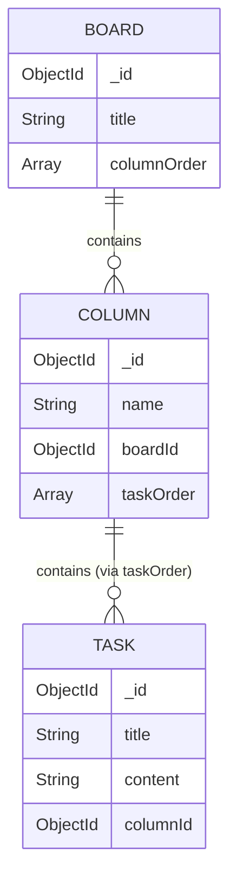
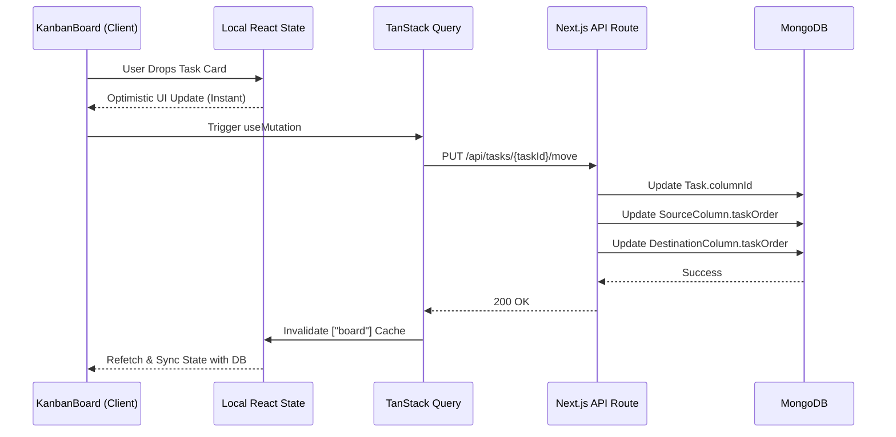

# KanbanFlow

A high-performance, real-time Kanban board application built with Next.js, React, and MongoDB. The application features a robust drag-and-drop interface with optimistic UI updates and a responsive design.

## Features

- Dynamic Kanban Board Layout: Create, edit, and organize columns and tasks.
- Advanced Drag and Drop: Powered by @dnd-kit to provide a seamless drag-and-drop experience.
- Optimistic UI Updates: TanStack React Query ensures instant visual feedback during drag operations before the database confirms the sync.
- Interactive Modals: Click on any task to open a detailed editing modal.
- Inline Editing: Quickly add tasks inline or edit the main workspace title with a click.
- Modern Aesthetics: Styled with Tailwind CSS and shadcn/ui components for a premium look and feel.

## Technology Stack

- Framework: Next.js 15 (App Router)
- Frontend Library: React 19
- Language: TypeScript
- Styling: Tailwind CSS
- UI Components: shadcn/ui
- Drag and Drop: @dnd-kit (core, sortable, utilities)
- State Management and Caching: TanStack React Query
- Database: MongoDB
- ODM: Mongoose

## Architecture

### Database Schema

The project relies on a relational MongoDB schema optimized for Kanban operations:
- Board: Manages a collection of columns.
- Column: Maintains an array of task IDs (taskOrder) to preserve precise vertical ordering without requiring O(N) database updates when a task is moved.
- Task: Standalone document for holding complex metadata (title, content, etc.).

### Drag and Drop Data Flow

## Getting Started

### Prerequisites

Ensure you have Node.js and npm installed. You will also need a running MongoDB instance.

### Installation

1. Clone the repository and navigate to the project directory.
2. Install the dependencies:
   npm install

3. Configure your environment variables. Create a .env.local file in the root directory and add your MongoDB connection string:
   MONGODB_URI=your_mongodb_connection_string

4. Seed the database to generate initial dummy data:
   Navigate to http://localhost:3000/api/seed in your browser or make a GET request to that endpoint. This will reset the database and create a default workspace.

5. Start the development server:
   npm run dev

6. Open your browser and navigate to http://localhost:3000.

## Development

The project is structured into three main layers:
- API Routes: Located in src/app/api/, handling RESTful operations for Boards, Columns, and Tasks.
- UI Components: Located in src/components/, containing the complex interactive logic for the Kanban board, columns, and task cards.
- Database Models: Located in src/models/, defining the Mongoose schemas.
